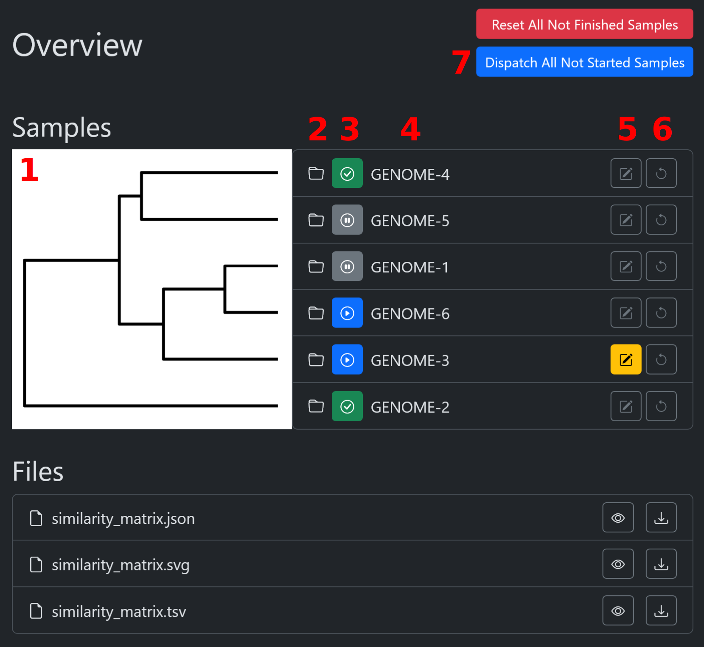

# 🛠️ Quick Start

## 1. Download Test Data

```bash
wget https://.../assembly-curator-test-data.tar.xz  # Todo
tar -xvf assembly-curator-test-data.tar.xz
```

## 2. Pull Docker Image

```bash
docker pull troder/assembler-curator
```

## 3. Run Assembly Curator

```bash
docker run -it --rm \
-v ./data-share:/data:Z \
-v ./plugins-share:/plugins:Z \
-p 8080:8080 \
--name assembly-curator \
troder/assembly-curator
```

## 4. Access the Interface

Open your browser and navigate to:  
`http://localhost:8080`

### 4.1 Overview

This page shows the content of the `/data` directory. Each sample to be assembled has its own directory.

- **View files**: Click on **1** to view files inside a directory.
- **Start curating a genome**: Click on **2** to start curating a genome. This process may take a minute.
- **Parallel preprocessing**: Click on **4** to start parallel preprocessing of samples in the background.
- **Reset a sample**: Click on **3** to reset a sample.

> **Tip:** Reload the page to see the progress of preprocessing.



### 4.2 Assembly.html

After clicking on a sample (**2**), you will be taken to the `assembly.html` page.

#### 4.2.1 ANI Matrix

The first image displayed is a clustermap with dendrograms of all contigs produced by different assemblers. The color scale indicates contig similarity, calculated using [pyskani](https://github.com/althonos/pyskani).

> [!NOTE]
> Multiple contigs may be grouped together if the assembly graph indicates they are connected.

The approach is similar to Trycycler's [Clustering Contigs](https://github.com/rrwick/Trycycler/wiki/Clustering-contigs):

> The goal of this step is to cluster the contigs of your input assemblies into per-replicon groups. It also serves to exclude any spurious, incomplete, or badly misassembled contigs.


**Usage:**
- **Diagonal Labels**: Indicates whether a contig is circular or linear (e.g., **1**: `lja#1` is **c**ircular).
- **Contig Selection**: Click on the diagonal to select a contig.
- **Size Factor**: The number off-diagonal (**2**) indicates the size factor between two contigs.
- **Context Menu**: Hover over cells to show more information. Right-click on cells to pin the context menu and click on Dotplot (**3**), which is calculated on the fly using [biowasm/minimap2](https://biowasm.com/cdn/v3/minimap2) and visualized using [Plotly](https://plotly.com/).

#### 4.2.2 Dotplots for Clusters

For each cluster in the ANI-matrix, you can view a matrix of dotplots calculated using [minimap2](https://github.com/lh3/minimap2) by clicking the corresponding button.

- **Green Contigs**: Indicates that the contig is circular.
- **Contig Selection**: Click on the diagonal to select a contig. Selected contigs will have a green border around the corresponding dotplot.


In the example, the same plasmid was found by three out of five assemblers:
- **hifiasm**: Failed to circularize it.
- **pacbio**: Circularized it but mistakenly duplicated it.
- **flye** (with `--meta` flag): Produced the correct result and was selected, hence the green border.

#### 4.2.3 Assembly Statistics

The figure presents various statistics for each assembly, including:
- **Total Length**
- **Number of Contigs**
- **GC-content**

A detailed list of contigs is provided, showing each contig’s corresponding cluster, topology, coverage, and GC-content. Interactive functionality allows selection by clicking on individual contigs. If an assembly graph file (`.gfa`) is available, the graph is displayed, allowing users to select associated contigs by clicking on labels within the plot. The plot is generated using a fork of [gfaviz](https://github.com/MrTomRod/gfaviz/tree/text-not-path).


#### 4.2.4 Export

At the bottom of the page, an `Export` button is available. Clicking it may prompt a few questions, produce a final overview, and create a hybrid assembly in `/data/$SAMPLE/assembly-curator/hybrid.fasta`.


# 5. Import your own assemblies

## 5.1. Prepare your assemblies (`/data`)

To import your own assemblies, place them in the `/data` directory. Each sample should have its own directory. The sample directory itself should contain an output folder per assembler. Example:

```text
/data
├── GENOME-1
│   ├── flye
│   ├── flye-meta
│   ├── hifiasm
│   ├── lja
│   └── pacbio
├── GENOME-2
...
```

## 5.2. Prepare assembly importers (`/plugins`)

For each assembly you want to import, you need to create a plugin in `/plugins`. The plugin should be a Python file that contains a class with the same name as the file itself.

```text
/plugins
├── FlyeImporter1.py
├── FlyeImporter2.py
├── FlyeImporter3.py
├── FlyeImporter4.py
└── FlyeImporter5.py

```

The class should inherit from `assembly_curator.AssemblyImporter`, check out the examples that I shared as examples.

If you have multiple assemblies from the same assembler, e.g. multiple Flye assemblies, just create one "proper" AssemblyImporter, e.g. `/plugins/FlyeImporter1.py` that may look something like this:

```python
from assembly_curator.AssemblyImporter import AssemblyImporter
from assembly_curator.Assembly import Assembly


class FlyeImporter1(AssemblyImporter):
    assembler = 'flye1'
    assembly_dir = 'flye1'
    assembly = 'assembly.fasta'
    gfa = 'assembly_graph.gfa'
    plot = 'assembly_graph.gfa.svg'

    def load_assembly(self) -> Assembly:
        contigs = self.load_fasta(f"{self._assembly_dir_abs}/{self.assembly}")
        ...
```

This importer will import from the directory `/data/$SAMPLE/flye1` and expect there to be the following files: `assembly.fasta` and `assembly_graph.gfa`.

To add another Flye assembly, just create another importer, e.g. `/plugins/FlyeImporter2.py` that inherits from `FlyeImporter1` and changes the `assembler` and `assembly_dir` variables:

```python
from FlyeImporter1 import FlyeImporter1


class FlyeImporter2(FlyeImporter1):
    assembler = 'flye2'
    assembly_dir = assembler
```

This importer will import from the directory `/data/$SAMPLE/flye2`.
